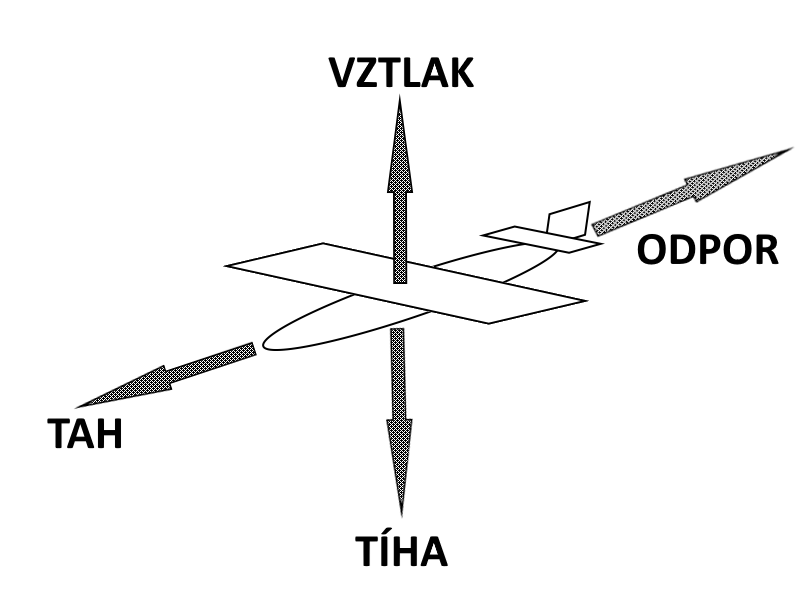

# Křídla

### hlavní
Hlavní křídlo jsem se rozhodl udělat o rozpětí 60cm a chord 13cm. Profil jsem si vybral **NACA 4412**, kvůli jeho dobrým vlastnostem při nizkých rychlostech. Ailerony budou odvozeny z profilu a budou mít asi 40cm dohromady. podle toho sem dá určit vše ostatní

### Výškovka
Pro výškovku by měl být profil neutrální takže sem zvolil profil **NACA 0012** bez nějakého vyššího důvodu. klapky budou po celé délce výškovky.

### Fin
Pro rudder sem se rozhodl že ani nebude mít žádné servo nebude se dát ovládat a ani tam nebude klapka. Model velikosti jako chci postavit já ho nepotřbuje. Profil bude též NACA 0012.

### tabulka hodnot :

| Křídlo       |           Rozpětí |       Chord | Profil    |   Plocha       |
| ------------- | ----------------: | ----------: | ---------: | --------- |
| Hlavní křídlo |         **60 cm** | **13 cm** | NACA 4412 |   0,078 m²   |
| Horizontal stabilizer      |         **20 cm** |    **8 cm** | NACA 0012 | 0,016 m²     |
| Fin           | **8 cm (výška)** |    **8 cm** | NACA 0012 |  0,0064 m²    |

# Aero základy

### Hlavní síly
Na letadlo při letu působí 4 hlavní síly a to **Vztlak**, **Tíhová síla**, **Tah** a **Odpor**. 

obr 1

Tah působí ve směru letu, odpor vzduchu působí proti tahu, vztlak působí kolmo k směru letu a tíhová síla působí vždy směrem k zemi.

### Rovnováha sil
V ustáleném přímém ideálním letu bez zrychlení jsou síly v rovnováze. Vztlak je přibližně roven tíze letadla a tah motoru vyrovnává aerodynamický odpor.

$L = W$,    $T=D$

kde $L$ je **vztlak** (Lift), $W$ je **tíhová síla** (Weight), $T$ je **tah** (Thrust) a D je **aerodynamický odpor** (Drag).

### Vztlaková rovnice
Velikost vztlaku závisí na rychlosti letu, hustotě vzduchu, ploše křídla a tvaru profilu. Vztlak lze vyjádřit vztahem

$L = \frac{1}{2}ρV^{2}SC_L​$

kde $ρ$ je hustota vzduchu, $V$ je rychlost letu, $S$ je plocha křídel a $C_L$ je koeficient vztlaku.

$C_L$ ustáleného vodorovného letu jsem získal podle vzorece

$C_L = \frac{2W}{ρV^{2}S}$ .

Tohle je $C_L$ pro **ustálený let**, $C_L,max$ je potom maximální koeficient vztlaku kdy křídlo jestě generuje vztlak.

### Indukovaný odpor křídla
indukovaný odpor křídel vyjadřuje vztah 

$C_{Di} = \frac{C^{2}_L}{π⋅e⋅AR}$,

kde $C_L$ je koeficient vztlaku, $e$ je Oswaldův faktor účinnosti který říká jak blízko má křídlo k ideálnímu rozložení vztlaku, kde 1 je ideální křídlo. Pro výpočet jsem počítal s $e=0,85$. $AR$ je poměr rozpětí křídla a plochy křídla

$AR = \frac{b^2}{S}$ $AR = \frac{0,6^2}{0,078}$ $AR = 4,62$,

kde $b$ je rozpětí křídla a $S$ je plocha křídla. Typicky nízké AR znamená víc indukovaného odporu tím pádem lepší manévrovatelnost.

obr 2: Indukovaný odpor křídla, $α = 0°$

obr 3: Indukovaný odpor křídla, $α = 7°$

V obr 2 jde vidět že $C_L = 0,26$ což znamená že vztlak je malý a tím pádem indukovaný odpor je malý. Podle výpočtů $C_{Di}=0,0054$. Naopak v Obr 3 je $C_L = 0,77$ proudění míří dolů a indukovaný odpor je vyší. Podle výpočtů $C_{Di}=0,048$. Analýza v XFLR potvrzuje tyto výpočty ale i přesto XFLR5 v některých bodech udává účinnost $e$ blízkou 1, což je chyba inviscidní metody simulace.

### Wing Loading
Wing Loading nebo Zátěž na křídlo je poměr váhy letadla a plochy křídla podle vzorce 

$WL = \frac{m}{S}$ ,  $WL = \frac{400}{0,078}$ $WL = 5,13$ $kg⋅m^{-2}$

kde $m$ je hmotnost letadla a $S$ je plocha křídel. Výsledek 5,128 $kg⋅m^{-2}$ odpovídá lehkému tréningovému modelu. Tato hodnota umožňuje nízkou přistávací rychlost.

# Reynoldsovo číslo
Z rozměru popsaných výše můžeme vypočítat Re. Použijeme pro to vztah
   
$Re = \frac{V ⋅ c}{v}$

kde $V$ je rychlost letu, $c$ je charakteristická délka neboli **chord** a $ν$ je kinematická viskozita vzduchu  (1.5 × 10⁻⁵ m²/s počítam jako konstantu).

při rychlsti 12 $ms^{-1}$ bude $Re$ hlavního křídla zhruba 104000. S tímhle číslem se dále pracuje při sumulacích. -> viz simulace

# objemový koeficient výškovky
(tail volume coefficient) určuje stabilitu výškovky. Pro moje použití chci 0,3 - 0,7.

$V_h = \frac{S_h ⋅ l_h}{S⋅c}$

kde $S_h$ je **plochav výškovky**, $l_h$ je **rameno výškovky** neboli vzdálenost aerodynamického  středu (počítám u tak 25% chordu) výškovky od hlavního křídla  , $S$ je **plocha hlavního křídla** a $c$ je **střední aerodynamická tětiva** u obdelníkového křídla (jako to moje) se $c =$ chord hlavního křídla 

takže po dasazení hodnot $s_h = 0,016$ $m^2$ 

 $l_h = l_{hl-vy} - \frac{C_{hl}}{4} + \frac{C_{vy}}{4} = 287,5$ $mm$ $=0,2875$ $m$, kde $l_{hl-vy}$ je vzdálenost výškovky od hlavního křídla, $C_{hl}$ je chord hlavního křídla a $C_{vy}$ je chord výškovky.
 
  $S = 0,078$ $m^2$ a $c = 0,13$ $m$ dostaneme $V_h$ = **0,454** . Výsledek odpovídá typickému rozsahu pro lehká letadla.

# objemový koeficient vertikálního stabilizátoru
Podobně jako $V_h$, $V_v$ určuje stabilitu vertikálního stabilizátoru neboli "finu". Pro moje použití chci 0,05-0,03.

$V_v = \frac{S_v ⋅ l_v}{S⋅b}$

kde $S_v$ je plocha vertikálního stabilizátoru, $l_v$ je rameno finu neboli podobně jako u $V_h$ zdálenost aerodynamického  středu (počítám u tak 25% chordu) vertikálního stabilizátoru od hlavního křídla, $S$ je plocha hlavního křídla a $b$ je rozpětí hlavního křídla.

$l_v = l_{hl-fi} - \frac{C_{hl}}{4} + \frac{C_{fi}}{4} = 297,5$ $mm$ $= 0,2975$ $m$, kde $l_{hl-vy}$ je vzdálenost výškovky od hlavního křídla, $C_{hl}$ je chord hlavního křídla a $C_{fi}$ je chord vertikálního stabilizátoru.

$S = 0,078$ $m^2$ a $c = 0,13$ $m$ dostaneme $V_v$ = **0,041** . Výsledek odpovídá typickému rozsahu pro lehká letadla.

# Stall speed
pro výpočet rychlosti při který křídlo přestane generovat vztlak použijeme vzorec

$V_{stall} = \sqrt{\frac{2⋅W}{ρ⋅S⋅C_{Lmax}}}$

kde $W$ je tíhová síla letadla ( $W = mg$ ), $ρ$ je hustota vzduchu (počítám s $ρ$ = 1.225 $kgm^{−3}$) $S$ je referenční plocha křídla, používá se plocha hlavního křídla a $C_{Lmax}$ je maximální součinitel vztlaku kdy křídlo jestě produkuje vztlak. Hodnotu $C_{Lmax}$ zjistim pomocí simulací v programu XFLR5.

váha podle odhadu vychází zhruba 400g.

$W = m⋅g = 3,92$ N , $S=0,078$ m²

$C_{l,max}$ podle simulace 2D profilu v Xfoil pro $Re=104000$, vyšel $C_{l,max}=1.32$ tohle je pro 2D křído, kde se nepočítají žádné koncové víry, downwash a to že vztlak nemusí být rovnoměrně rozložený. Proto abychom z 2D získali 3D typicky se to vynásobý 0,75-0,85. takže 
$C_{L,max}=C_{l,max}⋅0.8$

$C_{L,max} = 1,06$

​$V_{stall} = \sqrt{\frac{2⋅3,92}{1,225⋅0,078⋅1,05}}$

$V_{stall} = 8,79$ $ms^{-1}$

tohle číslo je čistě pro hlavní křídlo když klapky jsou v neutrální pozici. Jakmile se klapky dají dolů/nahorů $C_{l,max}$ se změní. 
Z grafu v Xfoil vyčteme že $C_{l,max}$ když jsou klapky plně dolů $C_{l,max}=1,63$ které převedeme na 3D stejně jako předtím. Potom $V_{stall}$ pro klapky dolů je

$V_{stall} = 7,93$ $ms^{-1}$.

obr. 4 grafy Cl alpha 

# Podélná stabilita

Z analýzy momentové charakteristiky v XFLR5 vyplývá že, Moment koeficient při nulovém úhlu náběhu je  $C_{m0} = -0,049$. Záporná hodnota $C_{m0}$ indikuje přirozený stabilizační moment. Sklon křivky $\frac{dC_m}{dα} < 0$ potvrzuje statickou podélnou stabilitu.

Obr. 5: Grafy stability z XFLR5

Graf v levém dolním rohu ukazuje závislost momentu $C_m$
​ na úhlu náběhu. Záporná hodnota $C_m$
znamená přirozený moment natáčející nos k zemi. Výsledek je tak malý že to v podstatě indikuje, že letadlo je téměř
vyvážené při nízkých úhlech náběhu, což chceme pro efektivní let.

# výkon
Použiju motor **KAVAN Brushless C2822-1400** který má maximální tah s S3 LiPo baterií 500g, pomocí tohoto můžeme vypočítat poměr tahu mototru k hmotnosti letadla (Thrust-to-weight ratio) 

$\frac{T}{W}=\frac{500}{400}=1,25$,

kde $T$ je tah motoru a $W$ je tíha letadla. poměr $\frac{T}{W}$ 1,25 zajišťuje dostatečný výkon pro létání včetně vertikálního stoupání. 

# Letové podmínky
návrhová rychlost se kterou počítam 10-12 $ms^{-1}$

Re pro 10 $ms^{-1}$ je 87000, pro 12 $ms^{-1}$ 104000. Předpokládám že se bude letadlo pohybovat někde v rozmezí 80000-110000 Re. Jelokož tohle je pořád dost nízko tak klasický software jako je XFLR5 nebo openVSP neumí udělat správnou a přesnou viskózní 3D simulaci letu. Můžeme pouze udělat 2D simulace profilů.

XFLR není dokonalý a všehcny výpočty budu doplňovat realnými testy.

# Shrnutí klíčových parametrů

| Parametr | Hodnota | Jednotka |
|----------|---------|----------|
| Rozpětí hlavního křídla | 60 | cm |
| Chord hlavního křídla | 13 | cm |
| Plocha křídla | 0,078 | m² |
| Aspect Ratio (AR) | 4,62 | - |
| Wing Loading | 5,13 | kg/m² |
| Reynolds číslo (Re) | 80 000 - 110 000 | - |
| $V_h$ | 0,454 | - |
| $V_v$ | 0,0403 | - |
| Stall speed (clean) | 8,76 | m/s |
| Stall speed (flaps down) | 7,93 | m/s |
| Návrhová rychlost | 12 | m/s |
| Hmotnost | 400 | g |
| Thrust-to-weight | 1,25 | - |
| CG pozice | 28% MAC | - |